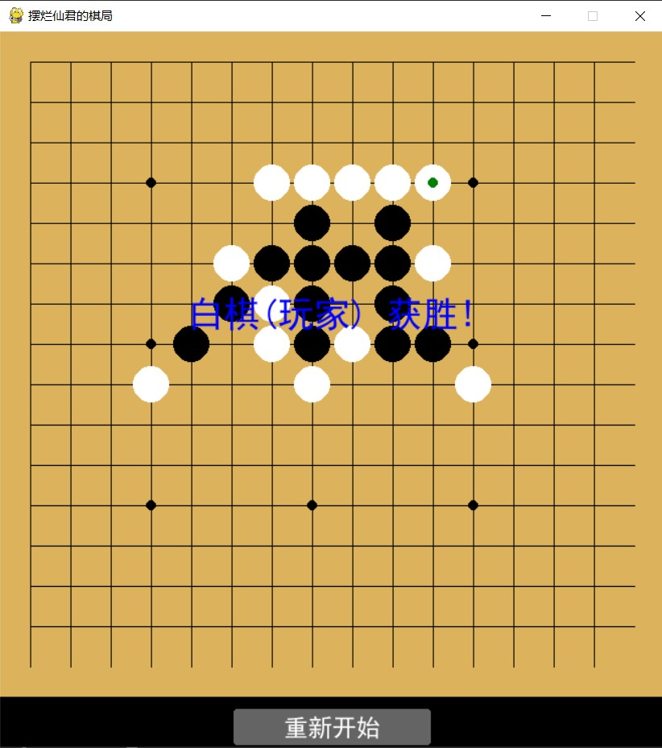

# 五子棋游戏 Gomoku 🎮  

  
  
  

一款基于Python和Pygame实现的五子棋人机对战游戏  

## ✨ 项目特点  

- 🎮 经典15×15五子棋棋盘  
- 🤖 智能AI对手（含简单评估算法）  
- 🖱️ 直观的鼠标操作界面  
- 🏆 自动胜负判定  
- 🔄 一键重新开始  
- 🎨 简洁美观的视觉设计  

## 📦 快速开始  

#### 安装依赖  
pip install -r requirements.txt
#### 运行游戏
python main.py
#### 🖥️ 游戏截图

## 📂 项目结构

Gomoku/

├── main.py          # 主程序入口

├── init.py          # 游戏初始化和常量配置

├── draw.py          # 游戏界面绘制

├── logic.py         # 游戏逻辑和AI算法

├── requirements.txt # 依赖库列表

└── README.md        # 项目文档
## 🕹️ 操作说明
鼠标点击棋盘放置白棋

电脑会自动下黑棋

五子连珠即获胜

点击"重新开始"按钮重置游戏

## 🛠️ 技术栈
Python 3.9+

Pygame 2.6.1

NumPy

## 👨‍💻 关于作者
### 庹忠曜

南京邮电大学-智能科学与技术专业

✉️ b21041426@njupt.com
### 鲁健

南京邮电大学-智能科学与技术专业

✉️ b21041427@njupt.com
## 📜 开源协议
本项目采用 MIT License 开源

## 🤝 贡献指南
欢迎提交Issue和Pull Request！
贡献前请先阅读贡献指南

## 🚀 未来计划
增加难度等级

添加双人对战模式

实现悔棋功能

加入游戏音效

添加战绩记录系统

## ⭐ 欢迎Star和Fork！如有任何问题，请提交Issue。
